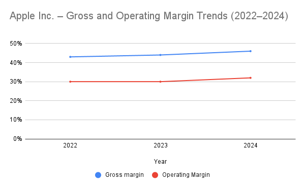
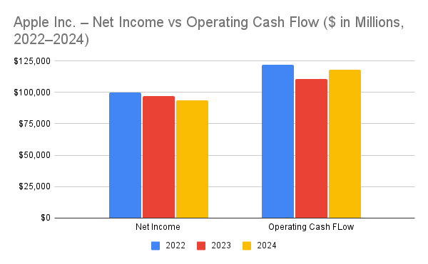

#Project Objective

This project aims to conduct a structured financial and business analysis of Apple Inc. using publicly available financial statements. The analysis follows the practical workflow of a financial, business, and data analyst by evaluating Apple’s income statement, balance sheet, and cash flow statement to assess profitability, financial stability, cash generation, and capital allocation decisions.

The project is designed as a hands-on analytical exercise using real company data to strengthen financial statement interpretation, analytical thinking, and data organization skills. Financial data is sourced directly from Apple Inc.’s Form 10-K filings, structured and analyzed using analytical tools, and documented in a clear, reproducible format suitable for professional and academic review.

 #Tools & Technologies Used

Google Sheets – financial statement modeling, calculations, and ratio analysis

GitHub – version control, documentation, and project organization

Public Financial Filings (Form 10-K) – primary data source

Python (Pandas, NumPy) – data handling and analytical workflows

Data Visualization Tools (Matplotlib / Seaborn / Tableau) – financial trend analysis and visual storytelling

Markdown & Jupyter Notebooks – structured reporting and reproducible analysis

# Expected Outcome

The objective of this project is to develop a clear, analyst-style understanding of Apple Inc.’s financial performance, business model, and long-term sustainability, while building a professional, portfolio-ready financial analysis project that demonstrates practical analytical skills relevant to academic admissions and entry-level analyst roles.

## Key Visuals

### Gross Margin vs Operating Margin (2022–2024)

### Net Income vs Operating Cash Flow (2022–2024)

### Free Cash Flow Trend (2022–2024)

 

## Key Takeaways

- Apple maintains strong and resilient profitability, with consistently high gross and operating margins, reflecting pricing power, brand strength, and effective cost control.
- Operating cash flow consistently exceeds net income, indicating high-quality earnings and efficient conversion of accounting profits into real cash.
- Apple generates substantial free cash flow even after capital expenditures, enabling sustained shareholder returns through dividends and share repurchases.
- The company’s balance sheet reflects deliberate capital allocation decisions rather than financial weakness, with stable liquidity, manageable debt, and reduced shareholders’ equity driven by aggressive buybacks.
- Overall, Apple demonstrates a mature, cash-generative business model with disciplined financial management and strong long-term sustainability.