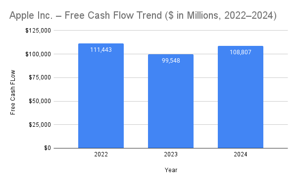

# Project Objective

This project conducts a structured financial and business analysis of Apple Inc. using publicly available financial statements from the company’s Form 10-K filings. The analysis follows a practical finance and business analytics workflow by reviewing Apple’s income statement, balance sheet, and cash flow statement to evaluate profitability, financial stability, cash generation, free cash flow, and capital allocation decisions.

The project was created as a hands-on analytical exercise to strengthen my financial statement interpretation, ratio analysis, trend analysis, data organization, and business reasoning skills. Financial data was sourced directly from Apple Inc.’s Form 10-K filings, organized in Google Sheets, and presented through clear visual summaries and written analysis suitable for academic, professional, and portfolio review.

# Tools & Technologies Used

Google Sheets – financial statement modeling, calculations, and ratio analysis

GitHub – version control, documentation, and project organization

Public Financial Filings (Apple Form 10-K, 2022–2024) – primary data source for Apple’s financial statement analysis

# Expected Outcome

The objective of this project is to develop a clear, analyst-style understanding of Apple Inc.’s financial performance, business model, and long-term sustainability, while building a professional, portfolio-ready financial analysis project that demonstrates practical analytical skills relevant to academic admissions and entry-level analyst roles.

## Key Visuals

### Gross Margin vs Operating Margin (2022–2024)

### Net Income vs Operating Cash Flow (2022–2024)

    

## Free Cash Flow Trend (2022–2024)

## Key Takeaways

- Apple maintains strong and resilient profitability, with consistently high gross and operating margins, reflecting pricing power, brand strength, and effective cost control.
- Operating cash flow consistently exceeds net income, indicating high-quality earnings and efficient conversion of accounting profits into real cash.
- Apple generates substantial free cash flow even after capital expenditures, enabling sustained shareholder returns through dividends and share repurchases.
- The company’s balance sheet reflects deliberate capital allocation decisions rather than financial weakness, with stable liquidity, manageable debt, and reduced shareholders’ equity driven by aggressive buybacks.
- Overall, Apple demonstrates a mature, cash-generative business model with disciplined financial management and strong long-term sustainability.
